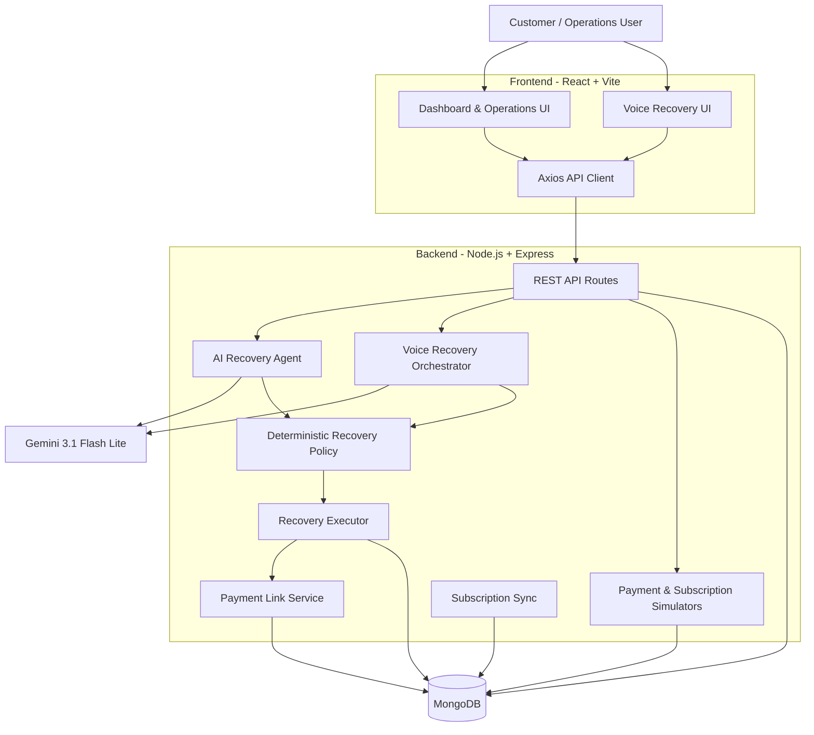

# Reclaim-AI

> **AI-powered revenue recovery platform for failed payments and subscription renewals.**
>
> **🚀 Try Reclaim-AI Live - https://reclaim-ai-deploy.vercel.app**

Reclaim-AI is a full-stack payment recovery system that combines **AI-driven recovery decisions** with a **deterministic policy layer** so that automation remains bounded, explainable, and safe.

The platform can analyze a failed payment, recommend the safest recovery action, execute only policy-approved actions, and expose the complete decision/execution trail through an operations dashboard.

---

## ✨ What Reclaim-AI Does

When a payment fails, Reclaim-AI follows a controlled recovery pipeline:

```text
Failed Payment
      │
      ▼
AI Recovery Agent
      │
      │  Recommends one action
      ▼
Deterministic Policy Layer
      │
      ├── Allowed ───────────────► Execute
      │
      └── Not Allowed ───────────► Safe fallback
                                      │
                                      ▼
                           Human Escalation / Stop
```

The system supports four recovery actions:

| Action | Purpose |
|---|---|
| `RETRY_PAYMENT` | Retry a temporary payment failure |
| `CREATE_PAYMENT_LINK` | Offer an alternative payment method after a card decline |
| `ESCALATE_TO_HUMAN` | Send cases requiring human review to escalation |
| `STOP_RECOVERY` | Stop automated recovery when further action is unsafe or unavailable |

---

## 🎯 Core Features

### AI-Powered Recovery

- Uses **Gemini 3.1 Flash Lite** for recovery recommendations.
- Produces a structured recovery decision with:
  - Suggested action
  - Confidence
  - Reason
  - Decision summary
  - Why the action is appropriate
  - What happens next
- AI recommendations never bypass the deterministic policy layer.

### 🛡️ Deterministic Guardrails

Financial recovery actions are policy-controlled.

Current rules include:

- Maximum of **3 actual payment retry attempts**
- Payment must still be in a `failed` state
- Payments of **₹20,000 or more require human escalation**
- Unknown failure scenarios require human investigation
- AI confidence must be **at least 0.70**
- `RETRY_PAYMENT` is permitted only for `TEMPORARY_FAILURE`
- `CREATE_PAYMENT_LINK` is permitted only for `CARD_DECLINED`
- Invalid or unsafe AI recommendations are rejected

This creates a separation between:

> **AI decides what may be appropriate. Policy decides what is actually allowed.**

---

## 🎙️ Voice Recovery

Reclaim-AI includes a browser-based voice recovery experience.

The frontend uses the browser's:

- `SpeechRecognition` / `webkitSpeechRecognition` for voice input
- `SpeechSynthesis` for spoken responses

The backend uses Gemini to understand the conversation and recommend a recovery action.

### Voice interaction flow

```text
Customer speaks
      │
      ▼
Browser Speech Recognition
      │
      ▼
Voice Recovery API
      │
      ▼
Gemini 3.1 Flash Lite
      │
      ▼
Specific recovery recommendation
      │
      ▼
Customer confirmation
      │
      ▼
Deterministic Policy Check
      │
      ▼
Recovery Executor
```

The voice flow intentionally separates **recommendation** from **execution**.

For example:

```text
Customer:
"My payment failed. Can you help?"

AI:
"I can create an alternative payment link.
Should I create it?"

Customer:
"Yes, create it."

System:
Policy check → CREATE_PAYMENT_LINK
              ↓
Payment link created
              ↓
Payment becomes pending
```

The voice assistant also avoids requesting sensitive payment information such as:

- Card number
- CVV
- OTP
- UPI PIN
- Passwords
- Banking credentials

---

## 💳 Payment Recovery Scenarios

The simulator supports these scenarios:

| Scenario | Typical behavior |
|---|---|
| `TEMPORARY_FAILURE` | Retry payment |
| `CARD_DECLINED` | Create alternative payment link |
| `REPEATED_FAILURE` | Stop after retry limit |
| `HIGH_VALUE_FAILURE` | Escalate to human |
| `UNKNOWN_FAILURE` | Escalate to human |

### Payment-link recovery

For a `CARD_DECLINED` payment, Reclaim-AI can create a simulated payment link.

The payment moves from:

```text
failed
  │
  ▼
pending
  │
  ├── successful customer payment → recovered
  │
  └── failed customer payment ────→ remains pending
```

The payment-link gateway is simulated locally; no real money is moved.

---

## 🔁 Subscription Recovery

The project also models subscription renewals.

Subscriptions can be:

- `active`
- `past_due`

Past-due subscriptions can have a linked failed renewal payment. Once recovery succeeds, the subscription synchronization service updates the subscription state accordingly.

The demo subscription simulator generates a mixture of:

- Active subscriptions
- Past-due subscriptions
- Failed renewal payments
- Different billing cycles
- Different payment methods
- Different recovery scenarios

---

## 🧠 Architecture



---

## 🏗️ Project Structure

```text
Reclaim-AI/
│
├── backend/
│   ├── config/
│   │   └── db.js
│   │
│   ├── controllers/
│   │   ├── agentController.js
│   │   ├── dashboardController.js
│   │   ├── paymentController.js
│   │   ├── recoveryController.js
│   │   ├── simulatorController.js
│   │   ├── subscriptionController.js
│   │   └── testRecoveryController.js
│   │
│   ├── models/
│   │   ├── AgentRun.js
│   │   ├── Customer.js
│   │   ├── Payment.js
│   │   ├── RecoveryLog.js
│   │   └── Subscription.js
│   │
│   ├── routes/
│   │   ├── agentRoutes.js
│   │   ├── dashboardRoutes.js
│   │   ├── paymentLinkRoutes.js
│   │   ├── paymentRoutes.js
│   │   ├── recoveryRoutes.js
│   │   ├── simulatorRoutes.js
│   │   ├── subscriptionRoutes.js
│   │   └── testRecoveryRoutes.js
│   │
│   ├── services/
│   │   ├── agent/
│   │   │   ├── agentBatchRunner.js
│   │   │   ├── agentTools.js
│   │   │   └── recoveryAgent.js
│   │   │
│   │   ├── aiRecoveryOrchestrator.js
│   │   ├── paymentGatewaySimulator.js
│   │   ├── paymentLinkService.js
│   │   ├── paymentSimulator.js
│   │   ├── recoveryExecutor.js
│   │   ├── recoveryPolicy.js
│   │   ├── subscriptionSimulator.js
│   │   ├── subscriptionSync.js
│   │   ├── voiceRecoveryOrchestrator.js
│   │   └── voiceRecoveryService.js
│   │
│   └── index.js
│
└── frontend/
    ├── src/
    │   ├── components/
    │   │   ├── common/
    │   │   ├── dashboard/
    │   │   ├── layout/
    │   │   ├── payments/
    │   │   └── recovery/
    │   │
    │   ├── hooks/
    │   ├── pages/
    │   ├── services/
    │   ├── utils/
    │   ├── App.jsx
    │   └── main.jsx
    │
    └── package.json
```

---

## 🖥️ Operations Dashboard

The frontend provides dedicated views for:

- Overview dashboard
- Payment ledger
- Failed payments
- Failed subscriptions
- Payment details
- Exceptions
- Guardrails
- AI Control Room

The recovery UI exposes AI decisions, policy decisions, execution results, and recovery timelines so that automated actions can be inspected rather than treated as a black box.

---

## 🛠️ Tech Stack

### Frontend

- React
- Vite
- React Router
- Axios
- Tailwind CSS
- Lucide React
- Browser Speech Recognition API
- Browser Speech Synthesis API

### Backend

- Node.js
- Express
- MongoDB
- Mongoose
- Google GenAI SDK
- CORS
- dotenv

### AI

**Gemini 3.1 Flash Lite**

The AI is used for structured recovery recommendations and the conversational voice-recovery experience.

---

## 🚀 Getting Started

### Prerequisites

Make sure you have:

- Node.js installed
- MongoDB available
- A Gemini API key

---

### 1. Clone the repository

```bash
git clone https://github.com/raj-aayush01/Reclaim-AI.git
cd Reclaim-AI
```

---

### 2. Configure the backend

```bash
cd backend
npm install
```

Create a `.env` file inside `backend/`:

```env
PORT=5000
MONGO_URI=your_mongodb_connection_string
GEMINI_API_KEY=your_gemini_api_key

# Optional simulator controls
FORCE_RETRY_FAILURE=false
FORCE_LINK_PAYMENT_FAILURE=false
```

Do not commit your `.env` file or API keys to GitHub.

---

### 3. Start the backend

```bash
npm start
```

The backend runs on:

```text
http://localhost:5000
```

Health check:

```text
GET /api/health
```

---

### 4. Configure the frontend

Open a second terminal:

```bash
cd frontend
npm install
npm run dev
```

By default, the frontend API client uses:

```text
http://localhost:5000/api
```

To use a different backend URL, create `frontend/.env`:

```env
VITE_API_BASE_URL=http://localhost:5000/api
```

---

## 🧪 Generating Demo Data

The project includes a built-in simulator.

Generate payment and subscription data:

```bash
curl -X POST http://localhost:5000/api/simulator/generate \
  -H "Content-Type: application/json" \
  -d "{\"count\":200,\"subscriptionCount\":60}"
```

The simulator generates failed-payment scenarios as well as subscription data for the dashboard.

---

## 🧪 Creating a Deterministic Test Payment

For testing a specific recovery scenario, the backend exposes a test-payment endpoint.

Example: create a card-declined payment:

```bash
curl -X POST http://localhost:5000/api/test/payment \
  -H "Content-Type: application/json" \
  -d "{\"scenario\":\"CARD_DECLINED\",\"amount\":3299,\"attemptCount\":1,\"failureReason\":\"card_declined\"}"
```

This creates a failed card payment that is compatible with the payment-link recovery policy.

For a temporary failure:

```bash
curl -X POST http://localhost:5000/api/test/payment \
  -H "Content-Type: application/json" \
  -d "{\"scenario\":\"TEMPORARY_FAILURE\",\"amount\":3299,\"attemptCount\":0,\"failureReason\":\"bank_timeout\"}"
```

---

## 🔌 API Overview

### Health

```http
GET /api/health
```

### Payments

```http
GET /api/payments
GET /api/payments/:paymentId
```

### Subscriptions

```http
GET /api/subscriptions
GET /api/subscriptions/:subscriptionId
```

### Dashboard

```http
GET /api/dashboard/summary
```

### AI Recovery

Run AI recovery for a payment:

```http
POST /api/agent/ai/:paymentId
```

Run batch recovery:

```http
POST /api/agent/batch
```

View the AI control room:

```http
GET /api/agent/control-room
```

View an agent run:

```http
GET /api/agent/runs/:paymentId
```

### Voice Recovery

```http
POST /api/agent/voice/:paymentId
```

Example request:

```json
{
  "message": "My payment failed, can you help?",
  "history": [],
  "phase": "INTRO",
  "voiceSessionId": "example-session-id"
}
```

### Payment Links

Complete a simulated payment link:

```http
POST /api/payment-links/complete/:paymentLinkId
```

### Simulator

```http
POST /api/simulator/generate
```

### Recovery Policy

```http
GET /api/recovery/policy-firings
```

---

## 🔐 Recovery Guardrails

The policy layer is intentionally deterministic.

```text
                    AI Recommendation
                           │
                           ▼
                 ┌───────────────────┐
                 │ Recovery Policy    │
                 │     Engine         │
                 └─────────┬─────────┘
                           │
              ┌────────────┼────────────┐
              │            │            │
           ALLOWED      REDIRECT       STOP
              │            │            │
              ▼            ▼            ▼
           Execute      Escalate     Stop Recovery
```

### Examples

**Temporary failure**

```text
TEMPORARY_FAILURE
        │
        ▼
RETRY_PAYMENT
        │
        ▼
Up to 3 actual retry attempts
```

**Card declined**

```text
CARD_DECLINED
        │
        ▼
CREATE_PAYMENT_LINK
        │
        ▼
Payment becomes pending
```

**High-value payment**

```text
Amount >= ₹20,000
        │
        ▼
ESCALATE_TO_HUMAN
```

**Unknown failure**

```text
UNKNOWN_FAILURE
        │
        ▼
ESCALATE_TO_HUMAN
```

**Retry limit reached**

```text
attemptCount >= 3
        │
        ▼
STOP_RECOVERY
```

---

## 🔄 Recovery Execution Model

The executor treats different actions differently:

| Action | Consumes retry attempt? | Possible result |
|---|---:|---|
| `RETRY_PAYMENT` | Yes | `RECOVERED`, `FAILED`, `STOPPED` |
| `CREATE_PAYMENT_LINK` | No | `PENDING` |
| `ESCALATE_TO_HUMAN` | No | `ESCALATED` |
| `STOP_RECOVERY` | No | `STOPPED` |

This distinction prevents payment-link creation or human escalation from being incorrectly counted as payment retry attempts.

---

## 🧩 Configuration

The backend recognizes these environment variables:

| Variable | Purpose |
|---|---|
| `PORT` | Backend server port |
| `MONGO_URI` | MongoDB connection string |
| `GEMINI_API_KEY` | Gemini API authentication |
| `FORCE_RETRY_FAILURE` | Force simulated retry failures |
| `FORCE_LINK_PAYMENT_FAILURE` | Force simulated payment-link completion failures |
| `VITE_API_BASE_URL` | Frontend API base URL |

---

## 🎬 Example End-to-End Recovery

```text
1. Payment fails
       ↓
2. Payment appears in Failed Payments
       ↓
3. Recovery agent analyzes payment
       ↓
4. Gemini recommends an action
       ↓
5. Deterministic policy validates the recommendation
       ↓
6. Approved action is executed
       ↓
7. Payment / subscription state is updated
       ↓
8. Recovery logs and agent run history are available
       ↓
9. Dashboard reflects the new state
```

For voice recovery:

```text
Customer request
       ↓
Voice AI understands context
       ↓
Concrete recovery option proposed
       ↓
Customer explicitly confirms
       ↓
Policy validation
       ↓
Action execution
       ↓
Voice session ends after recovery resolution
```

---

## ⚠️ Demo / Simulation Notes

Reclaim-AI currently uses simulated payment infrastructure.

The project includes simulated:

- Payment processing
- Payment retries
- Payment-link creation
- Payment-link completion
- Demo payment generation
- Demo subscription generation

Therefore, this repository demonstrates the **recovery orchestration, AI decisioning, policy enforcement, state management, and operations experience** without connecting to a real payment gateway.

The payment-link URLs generated by the simulator are demo URLs and do not represent real payment transactions.

---

## 💡 Design Principles

### 1. AI is not the final authority

The AI proposes a recovery action, but the deterministic policy layer decides whether that action is permitted.

### 2. High-risk actions are constrained

High-value and unknown-failure cases are routed to human review rather than guessed by the AI.

### 3. Execution is state-aware

Recovery actions are blocked when the payment has already reached a terminal state or is waiting for payment-link completion.

### 4. Recommendations and execution are separate

Especially in voice recovery, the system does not treat a generic confirmation as automatic authorization for an unknown action.

The flow is:

```text
Evaluate
   ↓
Recommend
   ↓
Explicit confirmation
   ↓
Policy validation
   ↓
Execute
```

### 5. Recovery is observable

AI decisions, policy decisions, recovery actions, and execution results are surfaced through the operations interface and recovery history.

---

## 📌 Current Scope

Reclaim-AI is currently designed as a **demonstration / prototype of an AI-assisted revenue recovery architecture**.

The core focus is:

- Failed-payment recovery
- Subscription renewal recovery
- AI-assisted decisioning
- Deterministic safety controls
- Voice-based recovery
- Payment-link recovery
- Human escalation
- Recovery observability

---

## 📈 Possible Future Extensions

Potential production-oriented extensions include:

- Event-driven payment failure ingestion
- Real payment gateway integrations
- Persistent voice-session storage
- Authentication and role-based access control
- Production-grade queueing and retries
- Webhooks for payment-link completion
- Persistent audit/event streams
- More sophisticated policy configuration
- Metrics and alerting
- Multi-tenant support

---

## 👤 Author

**Aayush**

GitHub: [@raj-aayush01](https://github.com/raj-aayush01)

---

## ⭐ Reclaim-AI

> **Recover revenue with AI — but keep execution under control.**
